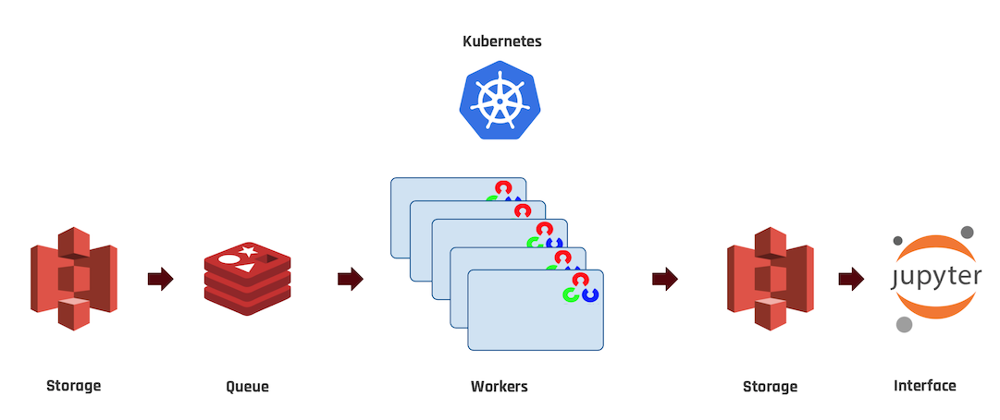

A Distributed Image Processing Pipeline

## Description
Imagine for a moment that you're a data scientist.
You'd like to train a new neural network on a lot of images, but the size of your dataset is small.
Maybe your data consists of medical imaging which can be difficult to acquire in bulk. 
You realize you can leverage your existing small dataset through image augmentation. 

For example you could flip each image left-right, and double your training set.
You could randomly rotate each image a few degrees, and double the set again.
There are numerous transformations you can apply, and for each you double the size of your dataset. 

Some machine learning frameworks have optional transformations built in: they can augment each image before feeding it into your network.
So you perform these transformations, and train your network.
Then you want to try a slightly different model, so you repeat the process from scratch. 
For each iteration of your model you are augmenting your dataset. 
The time spent on these augmentations, you could be training your models. 

To do the necessary transformations we turn to OpenCV, an open source computer vision library. 
OpenCV has many transformations built in.
Some are easy, like flip, others can be hard. 
To rotate an image we need to apply a rotation matrix. 
To adjust the saturation we need to break the image apart, change the saturation, and stitch it back together. 

If we chain together 6 transformations, then for each input image we will have 64 output images. 
While we are generating these images, we need to be saving them to disk and reading in new images. 

So we write a script that does this, and as the number of inputs increase the time to completion increases geometrically in lockstep with the output size.
What if we could run multiples of this script simultaneously, each working on a subset of the inputs?

That is what kaleidoscope does.
We take your existing dataset, quickly perform the augmentation in parallel, massively increasing the number of images, and save the result to inexpensive disk storage for retrieval.

## Method
We realized that if we are running these scripts in parallel, each can be made independent of the others.
The processing script is embedded in a Docker Container
To run the Containers we turn to Kubernetes, an open source platform that manages containerized work flows.

We run a Kubernetes cluster on AWS EC2 instances. 
Kubernetes embeds the Containers in Pods, and each instance can host many pods. 
If a pod dies, kubernetes can reanimate it.
If the workload on the cluster is unbalanced, kubernetes can re-balance it by moving around Pods.

To manage the work assignments a Redis Work Queue is created.
The Work Queue is filled with batches of Keys retrieved from an S3 bucket.

Many Worker Pods are created, and they each take a batch of Keys from the Queue and run their script.
Data from the Workers is copied to an S3 bucket, and the script begins again.



### Tree
```
|--- super-duper-chainsaw
     |--- .gitignore
     |--- README.md
     |--- src
          |--- constants.py
          |--- image_augmenter.py
          |--- key_scraper.py
          |--- queue_maker.py
          |--- rediswq.py
          |--- tools.py
          |--- transformations.py
          |--- worker.py
     |--- kubernetes
          |--- kubernetes_config
               |--- README.md
               |--- create_secret_yaml.py
               |--- job.yaml
               |--- queue-maker-pod.yaml
               |--- redis-pod.yaml
               |--- redis-service.yaml
               |--- secret-pod.yaml
          |--- containers
               |--- queue-maker
                    |--- Dockerfile
                    |--- README.md
               |--- worker
                    |--- Dockerfile
                    |--- README.md
```
