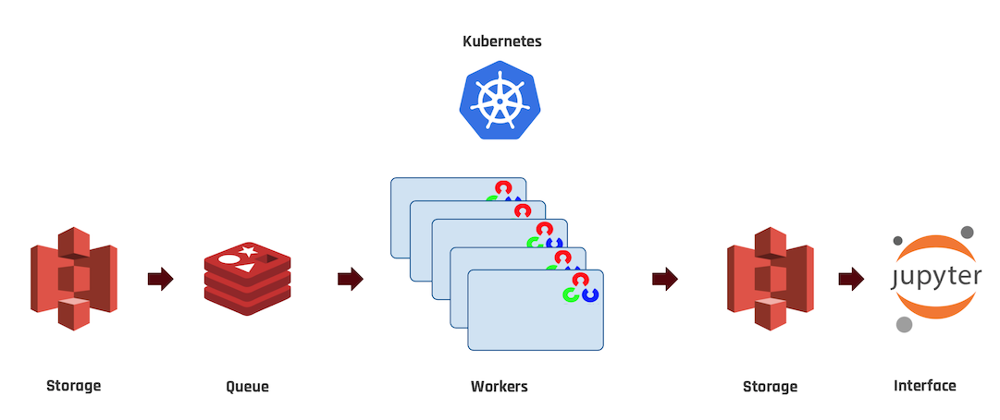

A distributed image augmentation pipeline developed as a Data Engineering Project for Insight Data Science.

## Description
Kaleidoscope takes in an image dataset and applies a series of chained transformations to augment the dataset. 
It performs these transformations in parallel using multiple replicated pods managed by Kubernetes, and saves the new images to an S3 bucket.

***
Imagine for a moment that you're a data scientist.
You'd like to train a model on a set of images, but the size of your dataset is small.
You realize you can leverage your existing small dataset through image augmentation. 

For example you could flip each image left-right, and double your training set.
You could randomly rotate each image a few degrees, and double the set again.
There are numerous transformations you can apply, and for each you double the size of your dataset. 

You find that your favorite machine learning frameworks has optional transformations built in, it can augment each image before feeding it into your network.
So you perform these transformations, and train your network.
Then you want to try a slightly different model, so you repeat the process from scratch. 
For each iteration of your model you are augmenting your dataset. 
The time spent on these augmentations, you could be training your models. 

You decide to write a script that does the transformations ahead of time, but you find that as the number of transformations increases linearly, the size of the dataset (and the number ofcomputations) increases geometrically.
Running this script just wont cut it. 
What if you could run multiple copies of the same script simultaneously, each on a subset of the dataset?

That's what kaleidoscope does.

### Details
To do the necessary transformations we turn to OpenCV, an open source computer vision library. 
Transformations are chained together, and applied so that work is not duplicated:
` TODO: Insert chaining pattern`

Given one image, and N transformations, 2^N images are generated.




### Installation

Clone the kaleidoscope repo:
```
git clone https://github.com/andrewasheridan/kaleidoscope.git
```
Create and activate a virtual environment that has Python 3.7, installed.
I like to use Conda for this:
```
conda create -n python37 python=3.7
conda activate python37
```

Navigate into `kaleidoscope` and do:
```
python setup.py install
```
This will install:
```
kaleidoscope
aws-cli
boto3
opencv-python
matplotlib
numpy
```

#### AWS Credentials

An AWS account is needed to use `kaleidoscope`, and your AWS credentials must available as local environment variables.

in `~/.bash_profile` add:
```
export AWS_ACCESS_KEY_ID=XXXX
export AWS_SECRET_ACCESS_KEY=XXXX
export AWS_DEFAULT_REGION=XXXX
``` 
 - with XXXX replaced with their values from your AWS Account.


#### Kubernetes Installation
The Kubernetes command line utility must be installed using [homebrew](https://brew.sh)
```
brew update && brew install kops kubectl
```

The name of your kubernetes cluster **must** be set in `~/.bash_profile`.
CLUSTER_NAME must be something completely unique, it will be used to create AWS S3 buckets.
```
export KOPS_CLUSTER_NAME=CLUSTER_NAME.k8s.local
export KOPS_STATE_STORE=s3://CLUSTER_NAME-kops-state-store
```

#### Environment variables
Make sure to activate the environment variables by sourcing `~/.bash_profile`:
```
. ~/.bash_profile
```


### Usage


### Presentation

