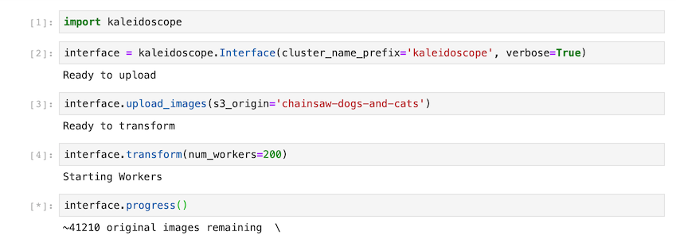

A distributed image augmentation pipeline developed as a Data Engineering Project for Insight Data Science.

## Description
kaleidoscope  takes in an image dataset and applies a series of chained transformations to augment the dataset. 
It performs these transformations in parallel using multiple replicated pods managed by Kubernetes, and saves the new images to an S3 bucket.

A common problem in computer vision is image datasets of limited size.
In machine learning this can lead to over fitting.

To alleviate this problem we can turn to image augmentation.
For example you could flip each image left-right, and double your training set.
You could randomly rotate each image a few degrees, and double the set again.
There are numerous transformations you can apply, and for each you double the size of your dataset. 

Augmentations take time and disk space, as augmentation can geometrically increase the size of a dataset, this can be costly.
Kaleidoscope performs transformations using OpenCV.
The transformations are run in Pods on a Kubernetes cluster, on AWS EC2 m4.large instances.

Kaleidoscope runs the pods in parallel, each working on a small portion of the image dataset

### Pipeline


Images are loaded into an S3 bucket then pointers to those images are grouped into batches and placed a redis work queue.
These batches are taken by worker pods which do the transformations, then transfered to an S3 bucket. All of this is accessible through a python package `kaleidoscope`


### Transformations
Given one image, and N transformations, 2^N images are generated. These transformations are chained together, and applied to reduce computation time.

For example, given and original image `img.jpg` and transformations named `a`, `b`, and `c`, we generate 8 images:

```
images = [ img.jpg, img_a.jpg, img_b.jpg, img_c.jpg, img_ab.jpg, img_ac.jpg, img_bc.jpg, img_abc.jpg ]                    
```
Here, the letters appended to the image name represent the transformations applied to the image, *and the order in which they are applied*. 

So given the filename `img_ab.jpg`, first load the image `img_a.jpg` and apply transformation `b`.

The following transformations are currently implemented:

- Rectangle reshaped to square with random centering, then resized to common size (default 400 x 400). This is applied to a raw image create the "original" image.
- Flip left-right.
- Random rotate and zoom in so only image is visible (no zeroed out areas).
- Random contrast adjustment.
- Random brightness jitter.
- Random saturation jitter.
- Noise - randomly selected between Gaussian, Poisson, and salt-and-pepper.


# Installation

An AWS account and Kubernetes command line interface must be installed prior to using `kaleidoscope`. 

#### AWS Credentials

Your AWS credentials must available as local environment variables.

in `~/.bash_profile` add:
```
export AWS_ACCESS_KEY_ID=XXXX
export AWS_SECRET_ACCESS_KEY=XXXX
export AWS_DEFAULT_REGION=XXXX
``` 
 - with `XXXX` replaced with their values from your AWS Account.


#### Kubernetes Installation
The Kubernetes command line utility must be installed using [homebrew](https://brew.sh)
```
brew update && brew install kops kubectl
```

The name of your kubernetes cluster **must** be set in `~/.bash_profile`.
CLUSTER_NAME must be something completely unique, it will be used to create AWS S3 buckets.
```
export KOPS_CLUSTER_NAME=CLUSTER_NAME.k8s.local
export KOPS_STATE_STORE=s3://CLUSTER_NAME-kops-state-store
```

#### Source Environment variables
Make sure to activate the environment variables by sourcing `~/.bash_profile`:
```
. ~/.bash_profile
```

#### Kaleidoscope Interface

Clone the kaleidoscope  repo:
```
git clone https://github.com/andrewasheridan/kaleidoscope.git
```
Create and activate a virtual environment that has Python 3.7, installed.
I like to use Conda for this:
```
conda create -n python37 python=3.7
conda activate python37
```

Navigate to `kaleidoscope` and do:
```
python setup.py install
```
This will install:
```
kaleidoscope
aws-cli
boto3
```


### Usage




### Presentation

